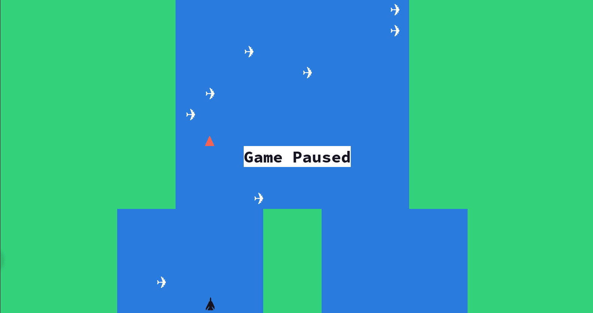

# River Raid Game



River Raid is an engaging arcade-style game developed in Rust. Pilot a military jet on a mission to destroy enemy jets by firing missiles. This project marks my first experiment in game development.

## Gameplay

Take control of a military jet flying over enemy territory. Your mission is to eliminate enemy jets by firing missiles while navigating through challenging environments.

## Controls

- **Ctrl+C**: Exit the game
- **P**: Pause/Unpause the game
- **Left Arrow**: Move jet to the left
- **Right Arrow**: Move jet to the right
- **Spacebar**: Fire missile

## How to Run

Ensure you have Rust and Cargo installed on your system. To run the game, execute the following command in your terminal:

```bash
cargo run
